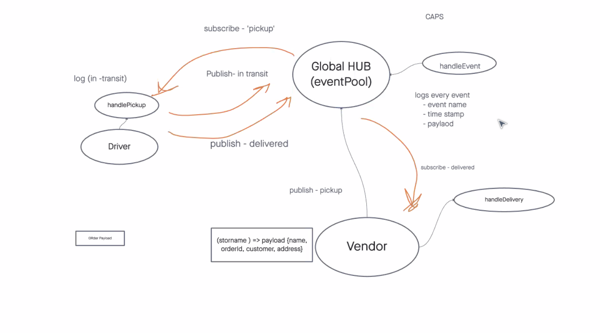
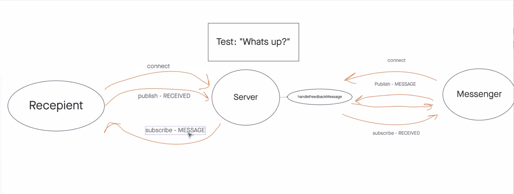
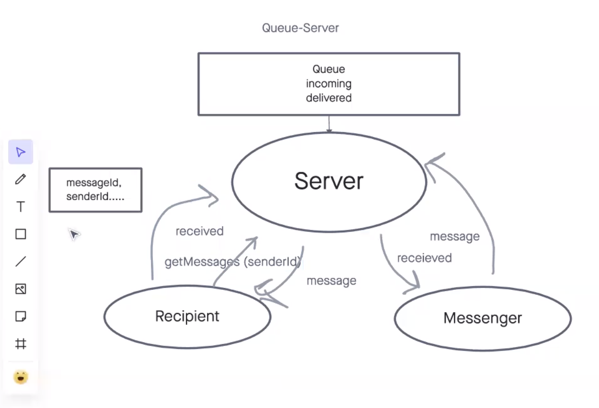

# CAPS - Event Driven Applications

**Lab 11**

For this lab we moved away from authentication and authorization, and are focusing on Event Driven Apps using Node.js. 

**Lab 12**

For this lab we expanded on what we started with lab 11 and introduced `sockets`!  We implemented a server using a `PORT`, and created different sockets that all connected to the `/caps` namespace.
The end result, or output of the code was essentially the same, but with a full refactor and a different implementation.

**Lab 13**

For this lab we closed out the Caps-Hub server!  I incorporated a `MessageClient` constructor that made new queues based on a vendorId and connected automatically to the appropriate rooms.  
I also implemented Queues so that `pickup` and `delivered` events would get logged and delivered to all clients upon log in. 

PR links can be found at the bottom of this document

Lab 11[^1]

Lab 12[^2]

Lab 13[^3]

[GitHub Repo](https://github.com/AndresMillsGallego/caps-hub)

## Installation

To install this app just follow these steps:

- Clone down this repo
- CD into your new directory
- npm install

And that is it!

[Node Docs](https://nodejs.org/en/docs/)

[Node Events Docs](https://nodejs.org/api/events.html)

## Usage

This is a great app to start off working with Node.js and the `Events` object that comes with it.  

## Contributors / Authors

Project by: Andres Mills Gallego

[My GitHub](https://github.com/AndresMillsGallego)

[My LinkedIn](https://www.linkedin.com/in/andres-mills-gallego/)

## Features / Routes

To start things off we are just using: 
- Node.js
- `Events` object
- jest
- `socket.io`
- `socket.io-client`

## Pull Requests

[^1]: [Class 11 Pull Request](https://github.com/AndresMillsGallego/caps-hub/pull/2)

[^2]: [Class 12 Pull Request](https://github.com/AndresMillsGallego/caps-hub/pull/3)

[^3]: [Class 13 Pull Request]()