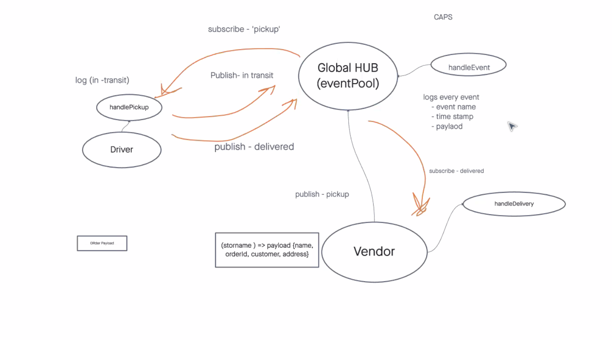

# CAPS - Event Driven Applications

**Lab 11**

For this lab we moved away from authentication and authorization, and are focusing on Event Driven Apps using Node.js. 

PR links can be found at the bottom of this document[^1]

[GitHub Repo](https://github.com/AndresMillsGallego/caps-hub)

## Installation

To install this app just follow these steps:

- Clone down this repo
- CD into your new directory
- npm install

And that is it!

[Node Docs](https://nodejs.org/en/docs/)

[Node Events Docs](https://nodejs.org/api/events.html)

## Usage

This is a great app to start off working with Node.js and the `Events` object that comes with it.  

## Contributors / Authors

Project by: Andres Mills Gallego

[My GitHub](https://github.com/AndresMillsGallego)

[My LinkedIn](https://www.linkedin.com/in/andres-mills-gallego/)

## Features / Routes

To start things off we are just using: 
- Node.js
- `Events` object
- jest

## Pull Requests

[^1]: [Class 11 Pull Request](https://github.com/AndresMillsGallego/caps-hub/pull/2)